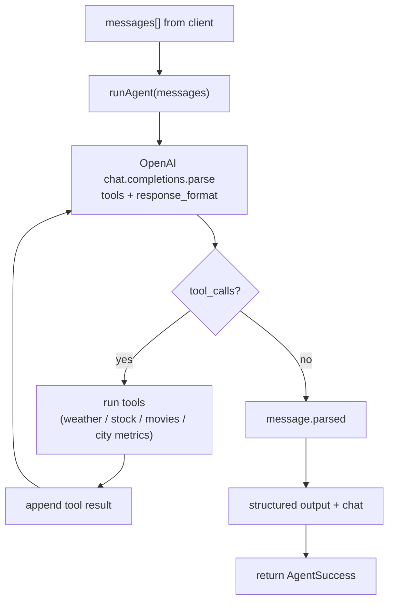

# OmniPlanner Agent

A weather-aware travel chatbot with a stock-quote side hustle, a **movies in theaters** tool, and a **US city cost-of-living** tool. You send a conversation (`messages[]`) and the LLM may call `get_weather`, `get_stock_data`, `get_local_movies`, or `get_city_metrics`, then returns **always** `chat: { "message": "..." }` plus **`output`**: a `TRAVEL_ITINERARY`, a `DECISION_REPORT`, or **`null`** on chat-only turns. All responses are validated with Zod. A working network and a valid `OPENAI_API_KEY` are required.

## Stack

- **Node 20+**, TypeScript, ESM, [Zod](https://zod.dev) for output validation
- **Commander** CLI, **Fastify** `/health` + `/chat` endpoints
- **OpenAI** structured outputs + function calling (`gpt-4o-mini` by default)
- **Open-Meteo** geocoding + forecast (no key)
- **Alpha Vantage** `GLOBAL_QUOTE` for stock quotes (free-tier key required; 5 req/min, 25/day)
- **The Movie Database (TMDb)** v3 `movie/now_playing` for `get_local_movies` ([API key](https://www.themoviedb.org/settings/api))
- **US Census Bureau** ACS 5-year + [Census Geocoder](https://geocoding.census.gov/) for `get_city_metrics` — the federal open-data (Data.gov ecosystem) source behind city income/rent signals. ACS requires a free [Census API key](https://api.census.gov/data/key_signup.html); the Geocoder does not.

## Repo layout

```
src/
  agent/      thin runAgent(messages) wrapper
  tools/      weather, stock, TMDb movies, Census city metrics; shared types
  lib/        geocoding helper
  llm/        OpenAI chat loop (tools + response_format)
  schemas/    Zod: `chat` + structured `output` (or null)
  cli.ts      `omniplanner run <message words...>`
  server.ts   Fastify HTTP interface
```

## Setup

```bash
npm install
cp .env.example .env
# edit .env and paste your OPENAI_API_KEY
```

`OPENAI_API_KEY` is **required**. If the OpenAI call fails (missing key, quota, network, refusal), the agent returns `{ ok: false, error }` with the message.

`ALPHA_VANTAGE_API_KEY` is **required** for `get_stock_data`. The free tier caps you at ~5 requests/minute and 25/day, so the system prompt tells the model to call the tool at most once per ticker per turn.

`THE_MOVIE_DB_API_KEY` is **required** for `get_local_movies`. The tool geocodes the **user’s city/place**, uses that result’s **ISO country** as TMDb’s `region`, and returns up to 10 **now playing** titles for that **country’s theatrical market** (not per-cinema or hyper-local zip granularity).

`CENSUS_API_KEY` is **required** for full US numbers from `get_city_metrics` (ACS median household income `B19013_001E` and median gross rent `B25064_001E`). Without it, the tool still responds but sets `limited: true` and falls back to a population-based `cost_index`. Non-US places always return `limited: true` since ACS is US-only; this is why the tool is framed as a **federal open-data (Census / Data.gov ecosystem)** signal rather than a single global “Data.gov” endpoint.

Optional env:

- `OPENAI_MODEL` (default `gpt-4o-mini`) — any OpenAI chat model that supports structured outputs + tools.
- `PORT` (default `3000`) — Fastify port.

## Common commands

| Command | What it does |
|---|---|
| `npm run dev -- run hi` | Run the CLI once via `tsx` (single-message chat) |
| `npm run dev -- run Plan a weekend in Seattle` | Same; all words after `run` are the prompt (no quotes required) |
| `npm run build && npm start -- run Compare TSLA and travel to NYC` | Build, then run from `dist/` |
| `npm run serve` | Fastify on `http://localhost:3000` with `GET /health` and `POST /chat` |
| `npm run lint:types` | Strict `tsc --noEmit` type check |
| `npm run test:e2e` | Playwright HTTP contract tests against `/health` and `/chat` validation (see [e2e/](e2e/)) |
| `E2E_LIVE=1 npm run test:e2e` | Also run the live agent round-trip spec (requires `OPENAI_API_KEY`) |

## Flow



A single `chat.completions.parse` call carries BOTH `tools` (`get_weather`, `get_stock_data`, `get_local_movies`, `get_city_metrics`) and `response_format` (the `AgentOutputEnvelope`: nullable structured `response` + `chat`). When the model calls a tool we execute it, append the result, and loop; when it stops calling tools we return the parsed envelope. Bounded to 24 iterations.

`get_stock_data` wraps Alpha Vantage `GLOBAL_QUOTE` and returns `{ price, trend, volatility_score }`, where `volatility_score` is a simple `(high - low) / previous_close` daily-range proxy clamped to `[0, 1]` — not implied vol.

`get_local_movies` (see [src/tools/movies.ts](src/tools/movies.ts)) geocodes the `city` argument (same Open-Meteo geocoder as weather, including comma fallbacks), then calls TMDb **`/movie/now_playing`** with `region` = that place’s **country code** (fallback `US` only if geocode has no `country_code`). Returns `{ location, region, movies }` where each movie has `title`, `release_date`, `vote_average`, and a truncated `overview`.

`get_city_metrics` (see [src/tools/geocost.ts](src/tools/geocost.ts)) geocodes the `city`, and for US places resolves **state + place (or county) FIPS** via the Census Geocoder, then fetches ACS 5-year `B19013_001E` (median household income) and `B25064_001E` (median gross rent) from `api.census.gov`. The Census missing-data sentinel `-666666666` is coerced to `null`. `cost_index` is a deterministic 0–100 score weighted toward rent (`0.7 * rent/$1,300 + 0.3 * income/$75,000`, scaled ×50 and clamped); when ACS numbers are missing the tool falls back to a population-based estimate and sets `limited: true`. Non-US places always return `limited: true` with income/rent `null`.

For `DECISION_REPORT` responses, [src/lib/investmentRules.ts](src/lib/investmentRules.ts) applies a deterministic rule after the model returns: if a stock’s `trend` is `"down"` **and** `volatility_score` **>** `0.7` (i.e. above 70 on a 0–100-style scale), that stock option’s score is reduced by 20 points (clamped to 0–100) and `recommendation` is set to the highest-scoring option’s `name` (stock option names should include the ticker, e.g. `"Invest TSLA"`, so the rule can match tool results).

## Agent contract

Responses conform to the Zod schema in [src/schemas/output.ts](src/schemas/output.ts):

- **`chat`** — always `{ "message": "..." }` (no `type` field). This is the **only** place for conversational prose on chat-only turns. For itineraries it is a short intro/wrap-up; for decisions it explains scores and tradeoffs.
- **`output`** — `TRAVEL_ITINERARY`, `DECISION_REPORT`, or **`null`**. When the user only needs a conversational reply, `output` is `null` and the reply lives entirely in `chat`.
- `TRAVEL_ITINERARY` — `{ type: "TRAVEL_ITINERARY", location, days[], budget_estimate, risk_flags[] }`. `budget_estimate` is an integer USD ballpark; `risk_flags` can only contain `"rain"`.
- `DECISION_REPORT` — `{ type: "DECISION_REPORT", options: [{ name, score }], recommendation }` only (no prose inside `output`).

## HTTP API

### `POST /chat`

Request:

```json
{
  "messages": [
    { "role": "user", "content": "plan a weekend in Seattle" }
  ]
}
```

Multi-turn: keep appending to `messages[]` on the client and send the full history each turn. The last message must have `role: "user"`.

Response (success):

```json
{
  "ok": true,
  "output": { "type": "TRAVEL_ITINERARY", "location": "...", "days": [...], "budget_estimate": 450, "risk_flags": [] },
  "chat": { "message": "Here's a concise intro or wrap-up for the trip..." },
  "toolCalls": [ { "name": "get_weather", "args": {...}, "result": {...}, "duration_ms": 123 } ]
}
```

`chat` is always present. For `DECISION_REPORT`, use `chat.message` for the narrative; keep scores only in `output`.

Chat-only success example:

```json
{
  "ok": true,
  "output": null,
  "chat": { "message": "Hello! How can I help?" },
  "toolCalls": []
}
```

Response (failure): `{ "ok": false, "error": "...", "toolCalls": [...] }` with HTTP 400 for validation errors, 422 for agent errors.

Example with `curl`:

```bash
curl -sS http://localhost:3000/chat \
  -H 'content-type: application/json' \
  -d '{"messages":[{"role":"user","content":"hi, how are you?"}]}'
```

### `GET /health`

Returns `{ "status": "ok" }`.

## End-to-end tests (Playwright)

The [e2e/](e2e/) folder contains Playwright HTTP tests that exercise the live Fastify server (no browser DOM — this is an API-only service). The Playwright `webServer` block in [`playwright.config.ts`](playwright.config.ts) starts the app on port `4173` and waits for `/health` before running the suite.

One-time setup (downloads the browser used as Playwright's HTTP runtime):

```bash
npx playwright install chromium
```

Run the deterministic contract tests (no OpenAI calls, no API keys needed):

```bash
npm run test:e2e
```

Include the live agent round-trip (uses tokens; requires `OPENAI_API_KEY` in `.env`):

```bash
E2E_LIVE=1 npm run test:e2e
```

The specs are split by concern: [`e2e/health.spec.ts`](e2e/health.spec.ts) covers `GET /health`, [`e2e/chat-validation.spec.ts`](e2e/chat-validation.spec.ts) covers the `POST /chat` 400 paths from `validateMessages` in [`src/server.ts`](src/server.ts), and [`e2e/chat-agent-live.spec.ts`](e2e/chat-agent-live.spec.ts) is gated behind `E2E_LIVE=1`.
